# R-CNN Tutorial

- [Lnit-RCNN_tutorial](https://blog.lunit.io/2017/06/01/r-cnns-tutorial/)

### Object detection

- `classification` + `localization`
- 물체를 구분하고, 위치까지 예측하는 방법

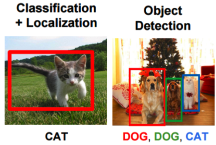

## Naive Approach

### Sliding window

- 여러 크기의 window을 가지고, `sliding window` 으로 이미지를 모두 탐색하면서 classification을 수행

- 문제점 : 탐색 영역수가 많기 때문에, 연산시간이 매우 오래 걸림

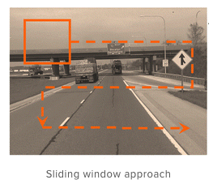

### Region Proposals

- 탐색 연산을 줄어들기 위해서, 물체가 있을 법한 영역을 찾아내는 알고리즘
- `selective search`, `edge boxes`

## R-CNN (Region proposal + CNN)

- Region proposal과 CNN을 합친 알고리즘

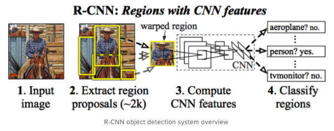

### 방법

- 이미지 내에서 `selective search` 을 이용해 영역을 추천
- 영역을 crop하고, 동일한 크기로 resize
- resize된 이미지를 CNN에 넣어 Classification (category + background) 진행
- 또한, bounding-box regression을 설정
  - `classification`, `bounding-box regression` 따로 처리
  - 분류기로 SVM 사용
  - Feature extract로 AlexNet 활용

### Bounding-box regression

- localization의 문제점
  - CNN의 경우, position invariance하기 때문에 물체가 중앙이 아니여도 물체 인식이 가능
  - 위치를 보정할 수 있는 region proposal을 실제 box에 mapping하는  `bounding-box regression` 을 학습

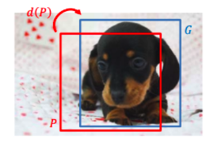

### 문제점

- 연산량이 많음 : 이미지 하나에 region proposal 갯수만큽 CNN의 연산이 필요하기 때문에 매우 느리다.
  - 기존의 방법
    - ImageNet으로 CNN 학습
    - 기존 Data을 이용해 CNN 다시 학습
    - region proposal에 학습한 CNN에 적용하여 feature vector을 추출
    - 추출된 feature vector을 SVM 학습
    - 추출된 feature vector의 box-regressor을 학습 

## Fast R-CNN

- main idea : RGB에 selective search을 적용하는 것이 아니라, feature map에 selective search을 적용하고, 동일한 vector을 얻기 위해서 `RoI Pooling`을 제안

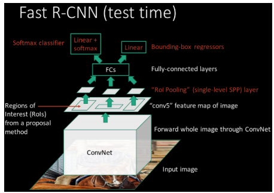

### 방법

- 미리 이미지에서 `selective search` 으로 region proposal 영역을 계산
- 그 후, 이미지를 CNN을 넣어 feature map을 얻고, 이전에 계산한 region proposal을 feature map에 적용
- 같은 feature map을 만들기 위해서, 각 region proposal에 max-pooling (`RoI Pooling Layer`)을 적용
- 마지막에 결과를 FC layer에 적용

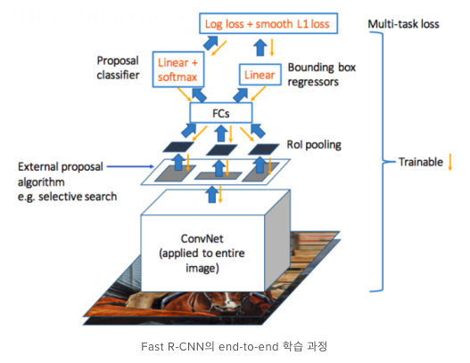

### RoI Pooling

- 기존의 Warping 방법은 이미지의 손실이 매우 크게 일어남.
- 동일한 크기의 벡터를 얻기 위해 방법

- SPP (Spatial Pyramid Pooling) : 동일한 크기로 영역을 나누어서 각 영역에 pooling을 적용, SPPNet에서 제안
- Fast R-CNN도 SPP (single level pyramid)을 이용한 RoI Pooling을 사용

### 장단점

- 장점
  - R-CNN에서 SVM과 bounding-box regressor을 따로 학습했지만, Fast R-CNN은 동시에 학습
- 단점
  - 여전히 region proposal에서 처리시간이 많이 소요됨

## Faster R-CNN

- main idea : 시간이 오래걸렸던 기존의 region proposal을 대신하여 CNN 내부에 region proposal을 생성하는 Network을 추가.
  - 실제 feature map을 시각화해 보면, feature map에 위치정보가 남아 있는 것을 알 수 있음.
  - 그렇기 때문에 feature map 정보를 이용해서 `RPN`(region proposal network)을 제안

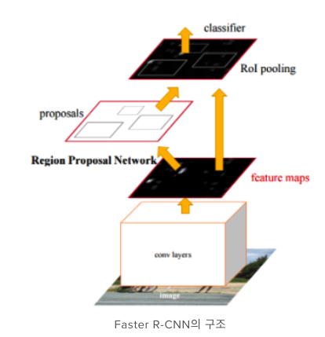

### RPN (Region Proposal Network)

-  `sliding window` 방법으로 feature map에서 NxN의 window값을 입력으로 넣어 줌.
- 그리고 난 후, window에 물체가 존재하는 여부를 파악하는 `classification network` 과 `bounding-box regression` 을 통해 전송

- 실제로는 nxn window만 사용할 경우, 다양한 크기와 비율을 계산하기 힘들기 때문에 미리 정해진 window을 활용
  - `anchor` : 미리 정해진 reference box, 여기서는 `128, 256, 512`크기 + `2:1, 1:1, 1:2` 비율로 총 9개 anchor 사용
- 모든 anchor 위치에 따른 `classification` 과 x, y, w, h의 `bounding-box regression` 값을 출력.

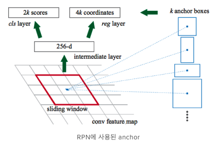

### alternating optimization

- Fast R-CNN과 RPN을 번갈아 가면 학습
- 방법(논문)
  - Pre-training된 네트워크 M0 준비
  - M0을 이용해 RPN M1 학습
  - M1을 통해 region proposal P1을 추출하고, 이를 이용해 새로운 Fast-RCNN모델 M2 학습
  - 이를 계속 RPN과 Fast R-CNN을 반복하면서 학습
  - NIP 논문일 마감이 얼만 남지 않아서 비효율 적으로 학습 되었음.

- 방법(실제)
  - RPN의 loss와 Fast R-CNN의 loss을 모두 합쳐 multi-task loss을 이용해 학습

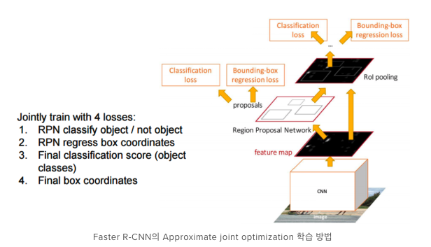

## Mask R-CNN

- Instance segmentation : 각 객체별로 segmentation을 함
  - Objective Detection : 객체인식이 가능하지만, segment가 불능
  - semantic segmentation : segment가 가능하지만, 객체 인식이 불능
  - 그래서 object detection + semantic segmentation = instance segmentation
  - `Faster R-CNN` + `FCN`

- Mask R-CNN : 기존 Faster R-CNN에 FCN을 추가한 네트워크

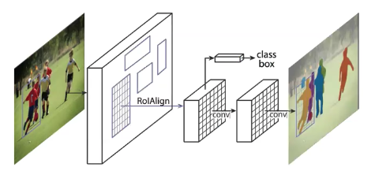

* Faster R-CNN + FCN

  * 기존에 classification, box reg에 `mask`부분을 추가

  * Faster R-CNN : Classification, Instance Level
  * FCN : Pixel-level Classification, Per Pixel Softmax  

  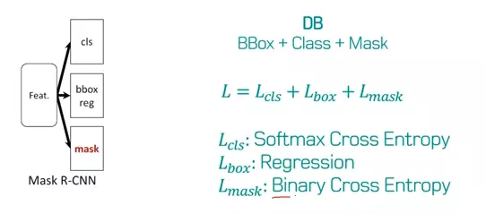

  * `Mask Classification`
    * 이미 Faster R-CNN에서 classification과 Intance을 찾아준다. 
    * 어떤 클래스인지 상관없이 어떤 물체의 영역가 어디 있는지 찾아주는 역할  (Binary mask)
    * 실제로는 모든 클래스의 mask를 찾고, classification을 기반으로 해당 클래스 mask만 사용
    * deconv을 이용해 upsampling하여, fully-convolution 구조  

 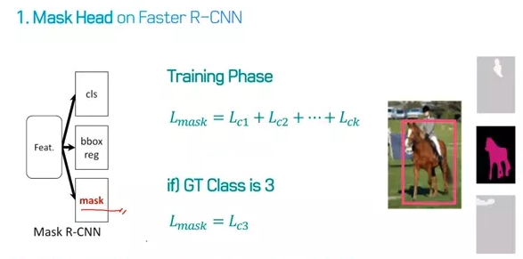

* RoI Align
  * RoI Pooling의 문제점: 정수의 픽셀에서의 위치를 찾기 때문에 정확하지 않는 값을 뽑아냄.
  * 실수 픽셀에서 pooling을 적용
  * 영역을 실수로 나누고, 각 sub-cell의 값을 bilinear interpolation을 이용해 계산
  * 실제 objection detect 성능을 향상 시킴

- Zero padding: RoI에 대해 zero padding을 적용

### 단점

- bounding box을 예측하지 못하면, segmentation이 불가능하다.