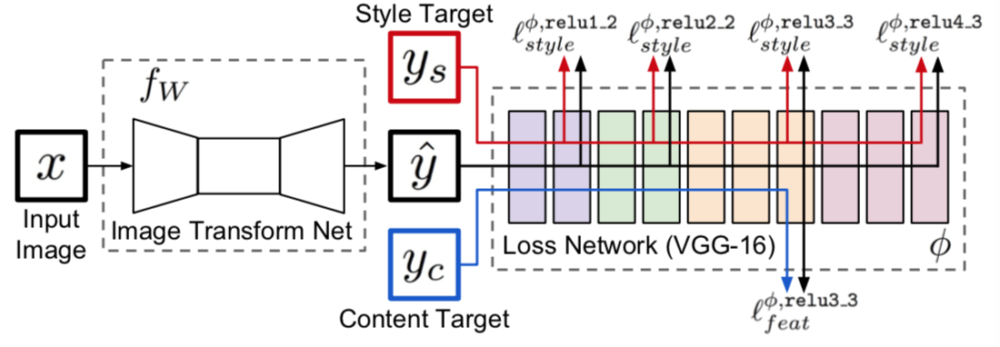
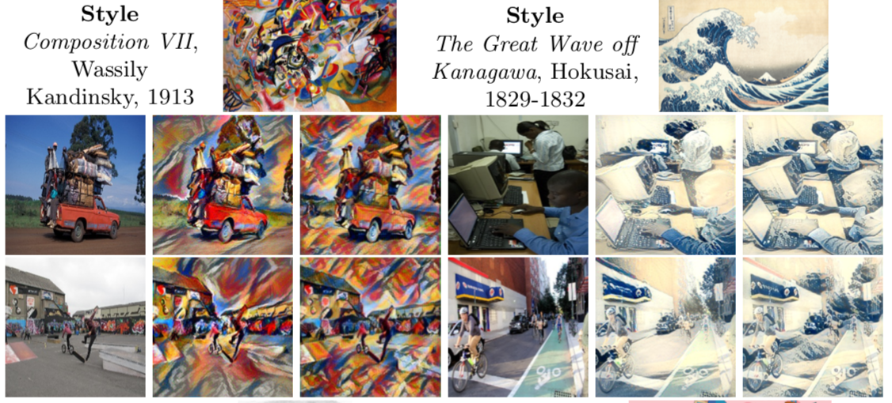
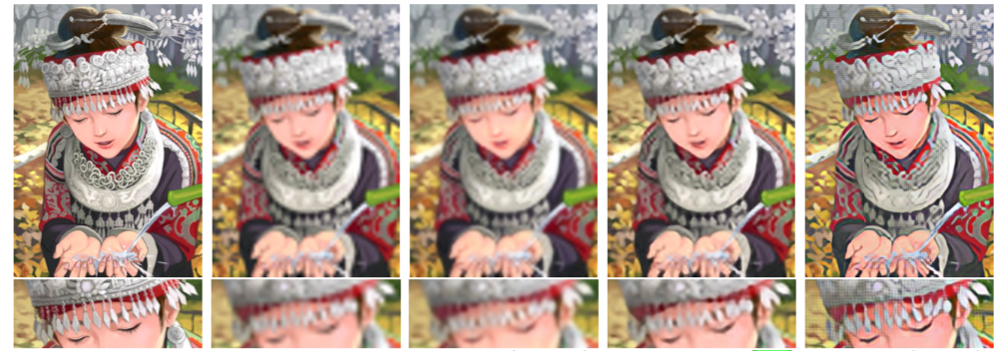

# Perceptual Loss for Real-Time Style Transfer

- Date : 2016.03
- Author : Justin Johnson, Alexandre Alahi, Li Fei-Fei

## Simple summary

>이 논문은 실시간으로 style transfer를 가능하게 만든 방법이다. 기존의 gatys가 제안한 논문은 transfer시 학습하는 시간이 필요했다. 하지만 이 논문은 이미지를 생성하는 Image Transfer Net과 loss 계산을 위한 fix된 Loss Net 두개로 나누어서 학습을 진행하여, feed forwad 가 가능하게 하여 빠른 이미지 transfer가 가능하게 했다.

## 목적

- style transfer의 기존 방법
  - per pixel : 
    - 장점 : feed forward 방식으로 빠름
    - 단점 : perceptron 특징을 잡지 못함
  - 기존의 perceptron을 이용한 방법
    - 장점 : 고품질의 결과를 생성
    - 단점 : 매우 느림
- 본 논문이 이 두가지 특징, 빠르면서 고품질의 결과를 생성하는 특징을 가지게 했음.
- 결과로 3배 빠르다.

## 방법

### 구성

- 두 개의 Network로 구성
  - Feed Forward Network : output 이미지를 생성하기 위해서 존재
  - Loss Network : loss를 계산하기 위해서 존재

### Loss function

- Pretrained 된 Loss Network를 이용해서 학습
- Feature representation loss 존재
- style reconstruction loss 존재

### 응용

- Style transfer : content image로 원본 이미지 사용
- Super resolution : input으로 low-resolution 이미지 사용, content image로 원본 이미지 사용, style image는 없음

## Feed Forward Network

- Pooling layer를 사용하지 않고, `strided or fractionally strided convolution` 사용해 upsampling, downsampling
- 5개의 residual block 사용
- Non-residual block은 BN, ReLU를 사용 (output 제외)
- Output layer는 tanh을 사용, pixel을 0~255로 표현하기 위해서,
- 첫 레이어와 마지막 레이어는 9x9 kernel을 이용했으며, 그외 레이어는 3x3 kernel을 이용했다.

### Input, Output

- Style transfer의 경우, input (3 x 256 x 256)
- Super Resolution의 경우, input (3 x 288/d x 288/d), output (3 x 288 x 288)

### Down sampling, Up sampling

- Super Resolution의 경우
  - 몇개의 Residual block은 f에 따라 log2f개의 fractionally convolution with 1/2 사용
    - fractionally convolution with 1/2 : 영상을 2배 interpolation 시킨 후, 1stride를 적용
- Style Transfer의 경우
  - Down-Sampling한 후, Up-Sampling 적용
  - 이유
    - 계산량 감소 
      -  D 다운 샘플링 진행시, D개의 필터를 더 사용이 가능
      - $9C^{2}HW ->  9C^{2}HW/D^{2}+9C^{2}HW/D^{2}$
    - 넓은 receptive field size가 가능
      - 1/2로 Down-Sampling 진행시, receptive field size는 2배가 됨

## Perceptual Loss Function

- 미리 학습된 VGG -16 이용

### Feature Reconstruction Loss

- Content image와 얼마나 비슷한 의미를 가지는 가를 나타냄
- 딥한 레이어에서 피쳐를 복원시, 공간적 구조는 유지 하지만, color, texture는 유지가 되지 않음
- 딥한 레이어에서 피쳐를 뽑아서 사용

### Style Reconstruction Loss

- Style image와 스타일이 얼마나 비슷한 지 측정
- Gram matrix을 이용

- correlation임으로 서로 다른 크기의 레이어도 같은 사이즈를 가짐
- 딥한 레이어일수록, 더 큰 scale structure을 가짐
- 다수의 레이어에서 feature을 뽑아서 사용

### Simple Loss Function

- Pixel Loss : SR의 경우, output에 대한 ground-truth가 있기 때문에 pixel loss 사용
- Total Variation Regularization : 공간적 smooth을 위해서 사용

## Experiments

- style transfer
  - Coco data
  - batch size 4, iter 40000 (2 epoch)
  - adam(lr : 0.001)
  - no weight decay, drop out
  - feature reconstruction loss : relu 2_2
  - style reconstruction loss : relu1_2, relu2_2, relu3_3, relu4_3
  - High-resolution을 위해, fully-convolutional 방법 사용
  - 속도 면에서, 500번 학습된 baseline 보다 3배더 빠르게 처리
- Super-Resolution
  - SRCNN : 3개의 layer 로 구성, per-pixel loss 이용
  - 기존의 PSNR, SSIM은 noise가 gaussian noise일 때 사용가능, 여기에 적합하지 않음, 그러므로 qualitative difference을 이용
  - CoCo data에 gaussian filtering을 진행후, down sampling
  - batch size 200k iter
  - Adam (lr : 0.001), no weight decay, dropout

### Style Transfer Result

### Super Resolution Result

