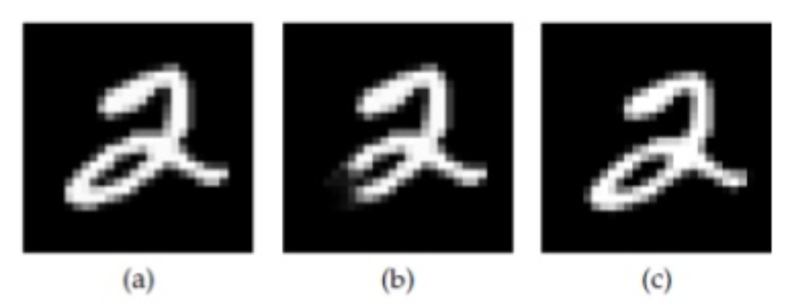
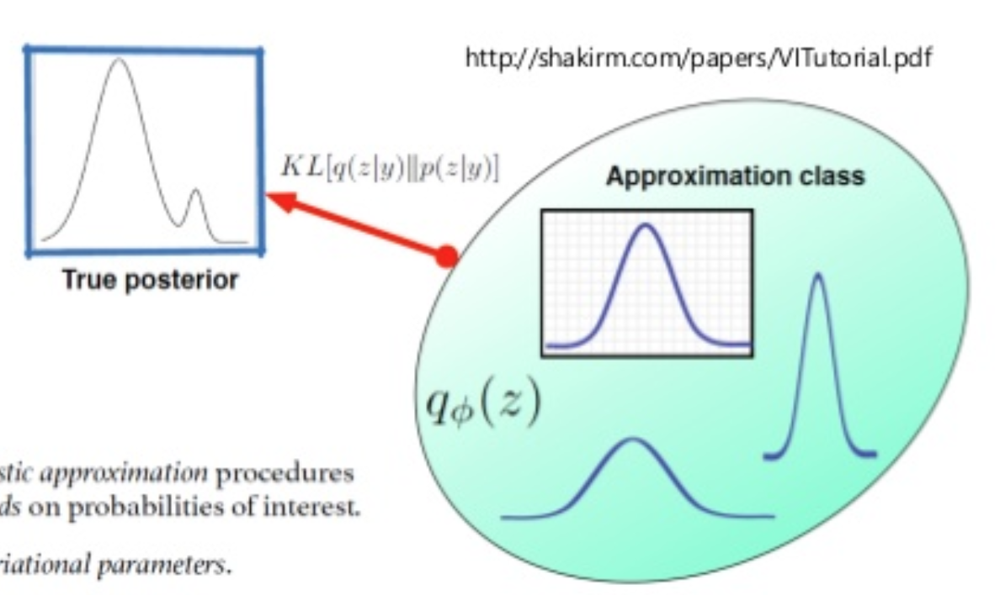
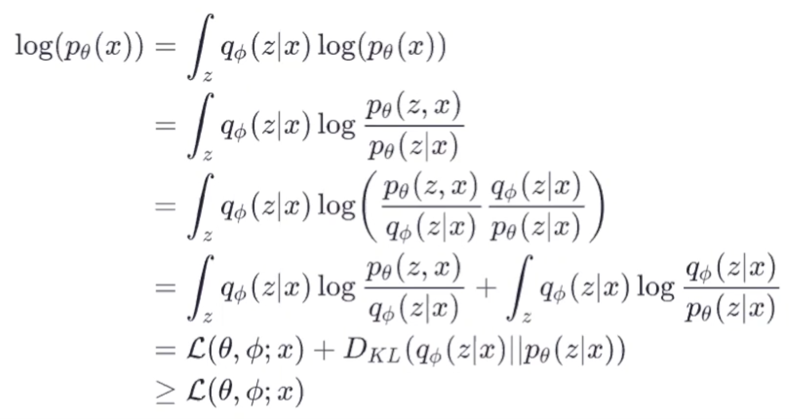
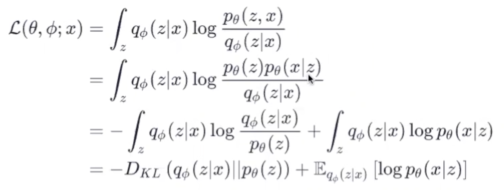
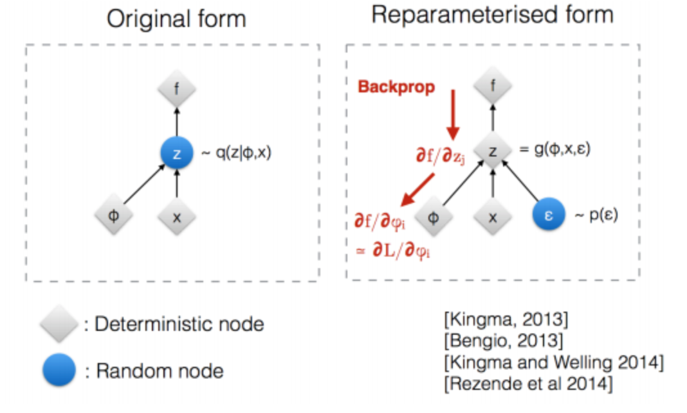
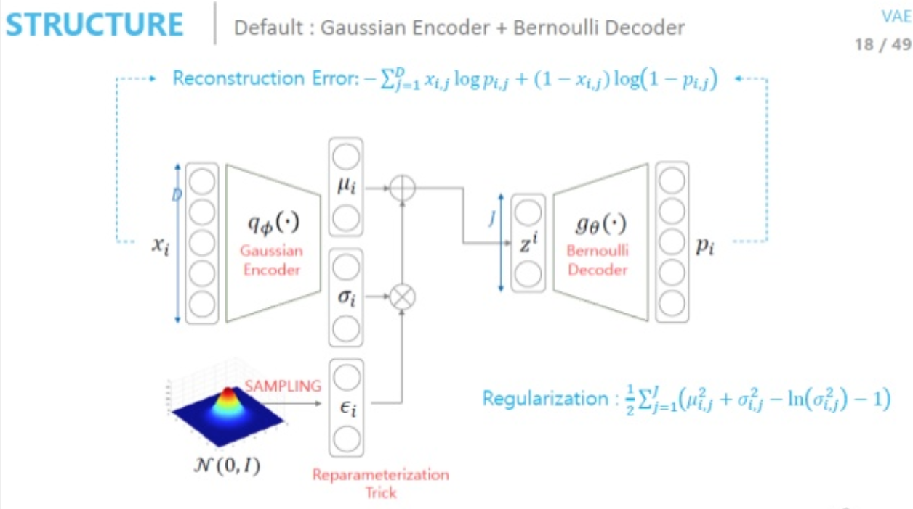
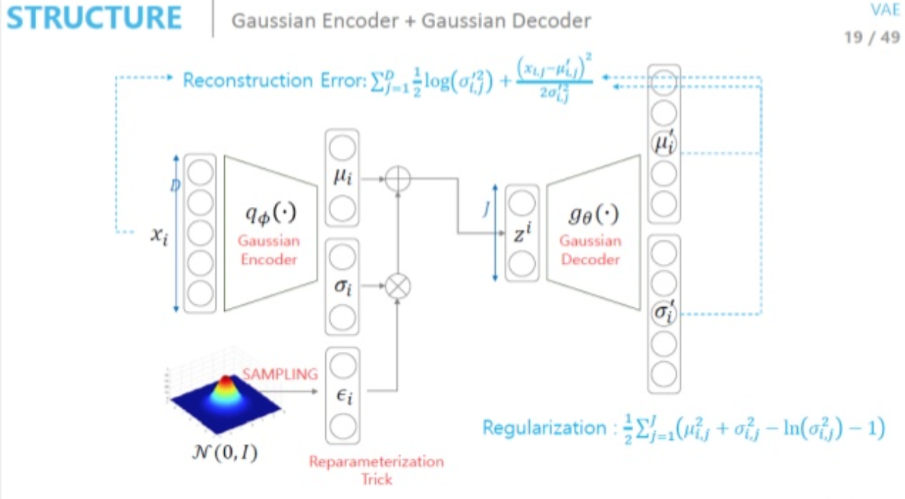
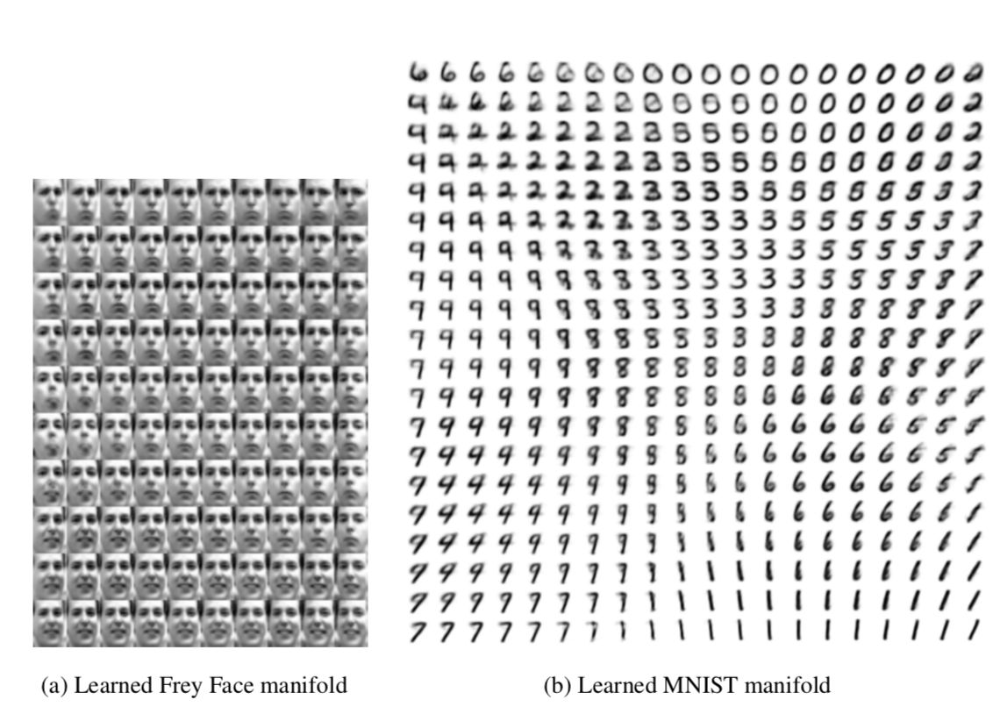

# Auto-Encoding Variational Bayes

- Date : 2013.12 

- Author : Diederik P. Kingma, Max Welling

## Simple summary

>VAE은 latent vector z에서 p(x)을 생성하기 위해 만들어 졌다. p(z)에서는 생성시 잘 되지 않기 때문에, p(z|x)을 이용해 p(x)을 생성한다. 하지만, p(z|x)을 모르기 때문에 다루기 쉬운 분포에 Variational Inference을 이용해 학습한다. 학습 할 때, SGA를 이용해 학습하기 위해 Reparametation trick을 이용해 구한다.

## AE vs VAE

- AE 
  - encoder 학습에 목적
  - Manifold learning, dimension reduction이 목적
- VAE
  - decoder 학습이 목적
  - latent vector z에서 데이터 **생성**이 목적
  -  z을 다루기 쉬운 확률분포을 이용해 생성

## VAE를 사용하는 이유

- 목적은 latent vector z에서  $p(x)$을 만드는 것

  - Maximum Likelihood를 이용해 학습

  $$
  \int\log p(x)=\int \log p(x,z)=\int \log p(x|z)p(z)
  $$

- Monte-carlo estimator를 직접 이용하지 않는 이유

  - $p(z)$ 을 알고있는 분포를 이용할 경우, Monte-carlo 적용 가능
  - $p(x|z)$ 을 gaussian을 이용했을 때, ML이 MSE Loss이 된다. 이 때, 밑 그림에서 (a, c)가 (a,b)보다 가깝지만, MSE에서 멀다고 측정된다. 
  - 그러므로, 학습이 잘 되지 않는다.  

  

- **Solution**

  - 랜덤 분포 $p(z)$에서 샘플링하는 것보다 데이터 x를 이용해 $p(z|x)$에서 샘플링
  - 그러나,  $p(z|x)$ 의 분포가 어떤지 모른다.
  - 그러므로, **Variational Inference**을 이용해 $q_{\phi}(z|x)$ (recognition model)을$p(z|x)$에 비슷한 분포로 생성

- **Variational Inference**

$$
\arg\min D_{KL}(p(z|x)||q(z|x))
$$

## The Variational bound

- $D_{KL}$은 항상 0보다 크다.

- **Lower bound** 혹은 **ELBO**

  - $L(\theta, \phi;x^{(i)})=E_{q_{\phi}(z|x)}[-\log q_{\phi}(z|x)+\log p_{\theta}(x,z)]$ 
  - Lower bound을 최대화 시킴

  

- 첫번째 Term

  - prior $p(z)$와 분포를 비슷하게 만드는 $\phi$을 regularization 역할  

- 두번째 Term

  - x를 복원하는 오차와 같음 (AE 과점)
  - negative log likelihood
  - **reconstructure error**

## SGVB (Stochastic Gradient Variational Bayes)

- ELBO를 Maximum하기 위해서 **Monte Carlo Method** 이용
  - 데이터 x에 대해서 L개의 데이터를 샘플링 (여기서는 L=1)
  - 하지만, 미분이 불가능

$$
L(\theta, \phi;x^{(i)})=-D_{KL}(q_{\phi}(z|x^{(i)})||p_{\theta}(z))+  {1 \over L}\sum (\log p_{\theta}(x^{(i)}| z^{(i,l)}))
$$

- **reparameterization trick**

  - 미분이 불가능한 걸 해결하기 위해서 사용

  

## Reparameterization trick 선택 방법

- inverse CDF가 가능한 것 

  - $\epsilon$ : 0에서 1의 uniform distribution 사용 
  -  $g_{\phi}(\epsilon,x)$: $q_{\phi}(z|x)$의 inverse CDF   

  - Cauchy, Logistic, Erlang 등등

- (Location-scale) 구조의 분포

  - $\epsilon$ : gaussian distribution 사용
  -  $g_{\phi}(\epsilon,x)$: location + scale*$\epsilon$
  - Gaussian, Uniform 등등

- Composition

## Stucture

## Example

## Reference

- 오토인코더의 모든것 - 이활석 https://www.slideshare.net/NaverEngineering/ss-96581209

- PR-010: Auto-Encoding Variational Bayes - 차준범, https://www.youtube.com/watch?v=KYA-GEhObIs
- 초짜 대학원생의 입장에서 이해하는 Auto-Encoding Variational Bayes (VAE) - 유재준, http://jaejunyoo.blogspot.com/2017/04/auto-encoding-variational-bayes-vae-2.html

- Auto-encoder - 이진호, https://www.slideshare.net/JinhoLee59/autoencoders-113630741?from_m_app=android