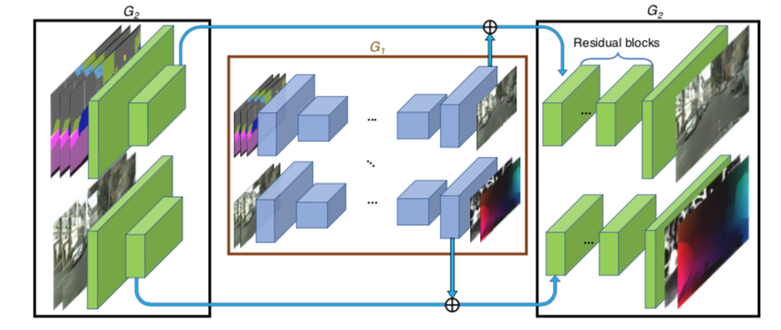
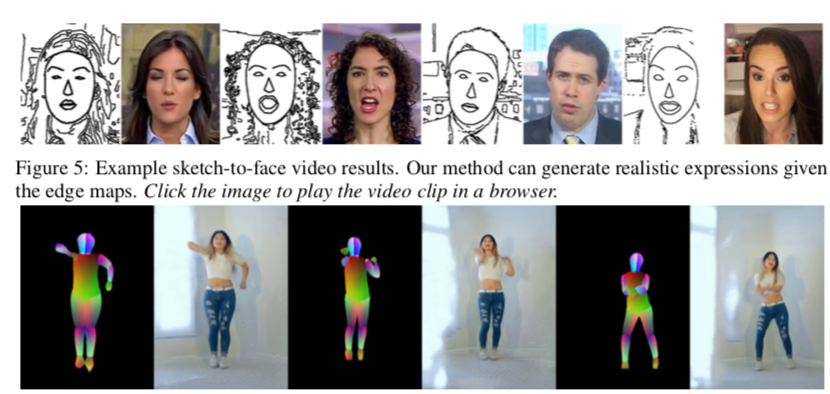
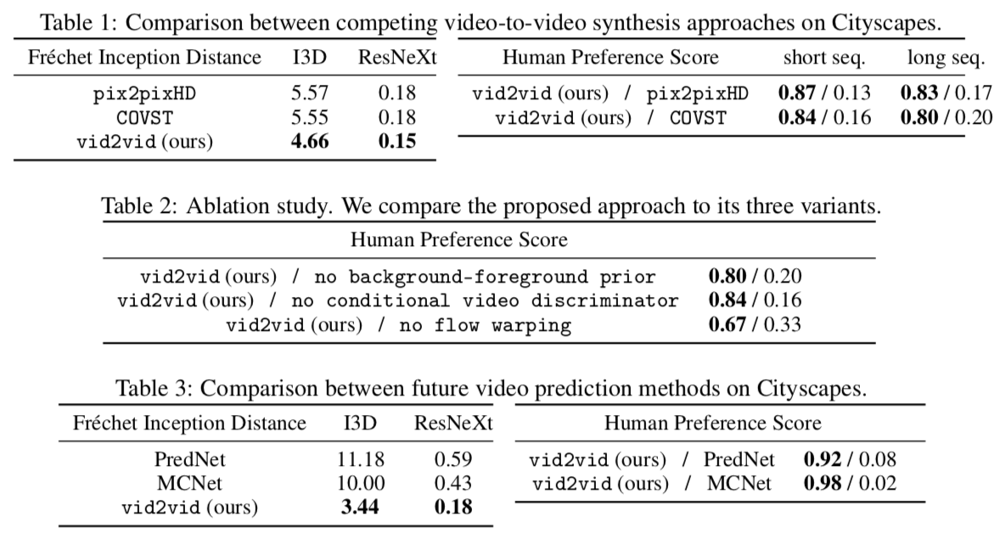

# Video-to-Video Synthesis

- Date : 2018.08

- Author : Ting-Chun Wang, Ming-Yu Liu, Jun-Yan Zhu, Guilin Liu, Andrew Taom Jan Kautz, Bryan Catanzaro

## Simple summary

>BEGAN은 discriminator을 auto-encoder을 사용하여, real 데이터와 fake 데이터의 auto-encoder loss의 W-distance을 loss로 삼는다. 기존의 EBGAN의 auto-encoder 개념과 WGAN의 개념을 동시에 사용한 듯 싶다. 또한, 여기서 D와 G가 안정적으로 학습하기 위해 equilibrium 개념을 소개한다. 이를 이용해 G와 D가 안정적으로 학습을 유도하고, image의 diversity을 control할 수 있으며, GAN의 수렴 척도를 계산할 수 있다.

## Notation

- Soure videos (semantic segmentation)

- Real videos (real)

- Output videos

- 목적 : source video를 넣었을 때, 나오는 Real video의 Conditional Dist와 source video를 넣었을 때 나오는 Generative video의 Conditional Dist를 같게 만드는 것, 즉, source을 넣었을 때 실제와 비슷한 값이 나오도록 학습

- **Conditional GAN**을 이용해 학습

## Network Architecture

### Generators

- Sequential generator : Markov를 이용해 학습
  - output을 만들기 위해서, `현재 source`, `이전 souce`와 `이전 생성된 output`을 넣어 준다.
  - L=2로 설정

- Mask, Optical flow

  

  - w : 예측한 optical flow
  - h : generative 이미지
  - m : mask 이미지, (0-1)사이의 값
    - 물체가 카메라 가까이 이동되면, 물체가 blur되는 현상이 발생. 마스크를 통해 수정

- Foreground-background prior

  

  - `background`의 경우, global transformation으로 `optical flow을 이용한 warp`이 이미지 생성을 더 잘함
  - `foreground`의 경우, 큰 움직임과 작은 크기로 optical flow을 이용한 warp이 어려워 `generated image`을 사용

- Coarse-to-fine generator: pix2pixHD를 이용

  

  - Low resolution network 
    - 입력으로 down-sampling하여 입력
    - source와 generate을 concat한 후 `residual block`을 거쳐 각각intermediate 결과를 생성하고 서로 더한다.
    - 더한 값을 input으로 hallucinated image와 optical flow와 mask (모델 공유)를 생성한다.

  

  - higher resolution network
    - Low resolution network의 위, 아래에 network를 추가
    - Higher resolution의 중간 값과 low resolution의 결과 값을 더한 후, 그 다음 residual block의 입력으로 들어간다.
    - 512x256, 1024x512, 2048x1024 3가지 단계을 이용

### Discriminator

- multiple discriminators : 

  - Conditional image discriminator (DI) : real image와 fake image를 구분
  - Conditional video discriminator (Dv) : (real image sequence와 real optical flow)와 (fake image sequence와 fake optical flow)를 구분

- Multi-scale PatchGAN 

  

  - resolution down sampling
  - frame rate down sampling(long term, short term) + resolution down sampling
  - 초기에는 제일 작은 scale이고 original sequence에서, scale을 키운 다음, frame rate을 키워서 계산
  - 3 scale을 이용
  - mode collapse을 이용

- Sampling

  - DI를 위해서 1에서 T사이의 uniform distribution에서 random으로 하나를 샘플링
  - DV를 위해서 K+1에서 T+1사이의 uniform dist에서 random을 하나를 샘플링

## Objective function

- LI : Image간 Loss

- LV : sequence영상과 optical flow의 Loss

- LW : flow estimation Loss (optical flow 자체 + warp image) 

- 추후에, feature matching loss과 VGG feature matching loss 실험
- LSGAN 이용

## 응용

### Multimodal synthesis

- F는 unimodal mapping function으로 하나의 style만 생성이 가능
- 하지만, multimodal mapping이 가능
- Real-image을 encoder-decoder 구조를 이용해 3차원 feature embedding을 생성한 후, instance별로 style을 조절하기 위해서 instance-wise의 feature average pooling을 시켜서 generator의 입력으로 들어간다.
- 그런 후, 같은 class에 대해서 gausian mixture을 수행한다.
- 그리고 inference할 때, 학습된 gausian mixture에서 샘플링하여 입력값으로 넣는다.

### Predict video

- 우선 future의 sementic을 생성한 후, 생성된 sementic을 실제 영상으로 변환
- 위에 LV을 이용해 학습

###Other

## 	Experiment

- 40 epoch
- ADAM (lr=0.0002, beta=0.5, 0.999)

- AMT을 이용해 AB test 진행 
  - 두 영상중 어느개 진짜와 가까운 지 조사
  - temporal coherence, image quality 조사
- FID (Frechet Inception Distance)
  - Inception을 이용한 video recognition CNN(ResNeXt, I3D)을 이용해 feature 을 얻고, feature의 평균과 공분산행렬을 계산하여, 이를 이용해 distance을 계산
  - 작을 수록 좋은 것

### 다른 비디오 변환 모델과 비교

### Multi-modal synthesis

### semantic manipulation

## Limitation

- 몇몇 실패하는 경우 발생, 예를 들어 차가 회전할 때 학습 정보 부족으로 실패
- 물체의 외관이 일관되기가 힘듬. 색이 계속 변환
- semantic manipulation시 모양이 달라서 잘못되게 출력 된다.